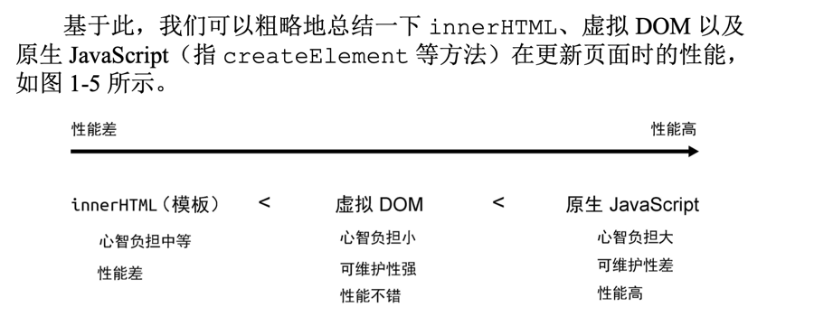

# Vue.js设计与实现



虚拟DOM的意义就在于使找出差异的性能消耗最小化

vuejs 是编译+运行时

死代码消除
这时我们发现这
段分支代码永远都不会执行，因为判断条件始终为假，这段永远不会
执行的代码称为 dead code，它不会出现在最终产物中，在构建资源的
时候就会被移除

死代码消除（Dead Code Elimination）

死代码消除的原理是：编译器在构建过程中分析代码逻辑，判断哪些代码片段永远不会被执行，例如 if (false) 或 if (process.env.NODE_ENV === 'production') 在某些场景下始终为 false，这类代码块被认为是无效的，最终不会出现在打包后的文件中。
Rollup 如何进行死代码消除

1.	Tree Shaking：
    •	Rollup 的 Tree Shaking 机制会通过静态分析依赖关系来移除那些没有被使用或引用的模块和代码。Rollup 会检查哪些模块和变量在代码中是未被使用的，然后移除它们，从而减小打包文件的体积。
2. 条件判断优化：
   •	在构建生产环境代码时，Rollup 通常会结合一些工具或插件（如 @rollup/plugin-replace）替换掉某些常量，比如 process.env.NODE_ENV === 'production' 这样的条件。在生产构建时，这个条件会被替换为 true 或 false。如果条件始终为 false，对应的代码分支就会被标记为“死代码”并被移除。

Tree-Shaking 因rollup.js而不普及
简单说就是消除那些永远不会被执行的代码
现在rollup webpack都支持
但是要实现tree-shaking 必须满足一个条件，那就是模块必须是esm 因为tree-shaking依赖esm的静态结构

tree-shaking中的第二个关键点--副作用
如果一个函数调用会产生副作用，那就不能将其一出，

副作用:调用函数的时候会对外部产生影响

例如修改 了全局变量。这时你可能会说，上面的代码明显是读取对象的值，怎
么会产生副作用呢？其实是有可能的，试想一下，如果 obj 对象是一
个通过 Proxy 创建的代理对象，那么当我们读取对象属性时，就会触
发代理对象的 get 夹子（trap），在 get 夹子中是可能产生副作用
的，例如我们在 get 夹子中修改了某个全局变量。而到底会不会产生
副作用，只有代码真正运行的时候才能知道，JavaScript 本身是动态语
言，因此想要静态地分析哪些代码是 dead code 很有难度，上面只是举
了一个简单的例子。

因为静态地分析 JavaScript 代码很困难，所以像 rollup.js 这类工具
都会提供一个机制，让我们能明确地告诉 rollup.js：
“放心吧，这段代
码不会产生副作用，你可以移除它。”具体怎么做呢？如以下代码所
示，我们修改 input.js 文件：

```js
 import {foo} from './utils'

 /*#__PURE__*/ foo()
```

注意注释代码 /*#__PURE__*/，其作用就是告诉 rollup.js，对于
foo 函数的调用不会产生副作用，你可以放心地对其进行 Tree-
Shaking，此时再次执行构建命令并查看 bundle.js 文件，就会发现它的
内容是空的，这说明 Tree-Shaking 生效了。

基于这个案例，我们应该明白，在编写框架的时候需要合理使用
/*#__PURE__*/ 注释。


***组件就是一组DOM元素的封装***
组件的返回值其实也是虚拟DOM
```js
 const MyComponent = function () {
     return {
         tag: 'div',
         props: {
         onClick: () => alert('hello')
         },
         children: 'click me'
     }
 }
```
```js
 const vnode = {
     tag: MyComponent
 }
```
就像 tag: 'div' 用来描述 <div> 标签一样，tag:
MyComponent 用来描述组件，只不过此时的 tag 属性不是标签名
称，而是组件函数。为了能够渲染组件，需要渲染器的支持。修改前
面提到的 renderer 函数，如下所示：
```js
 function renderer(vnode, container) {
     if (typeof vnode.tag === 'string') {
     // 说明 vnode 描述的是标签元素
         mountElement(vnode, container)
     } else if (typeof vnode.tag === 'function') {
     // 说明 vnode 描述的是组件
         mountComponent(vnode, container)
     }
 }

```
来看 mountComponent 函数是如何实现的： 其实很简单，就是用我们上面写的挂载DOM的那个函数
```js
 const vnode = {
    tag: MyComponent
 }


 function mountComponent(vnode, container) {
     // 调用组件函数，获取组件要渲染的内容（虚拟 DOM）
     const subtree = vnode.tag()
     // 递归地调用 renderer 渲染 subtree
     renderer(subtree, container)
 }

```

组件不一定得是函数，可以是对象

```js
 // MyComponent 是一个对象
 const MyComponent = {
    render() {
         return {
             tag: 'div',
             props: {
                 onClick: () => alert('hello')
             },
             children: 'click me'
         }
     }
 }
```
***vue.js中的有状态组件就是使用对象结构来表达的***


无论是手写虚拟DOM（渲染函数，也就是我们上面写的那些）还是使用模块，都属于声明式的描述ui，vue同时支持这两种描述ui的方式，上面我们讲解了
虚拟DOM是如何渲染成真实DOM的，那么模板是如何工作的，这就要提到vue框架中另外一个重要组成部分，***编译器***

编译器和渲染器一样，只是一段程序而已，不过他们的工作内容不同，编译器的作用就是将模版编译成渲染函数，可以理解为编译成虚拟DOM
编译器的***作用***
```html
 <div @click="handler">
     click me
 </div>
```
编译后
```js
 render() {
     return h('div', { onClick: handler }, 'click me')
 }


```

看到了61页