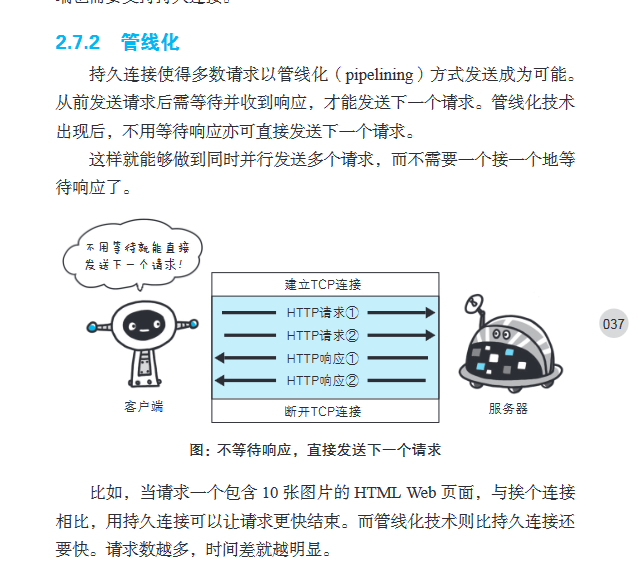
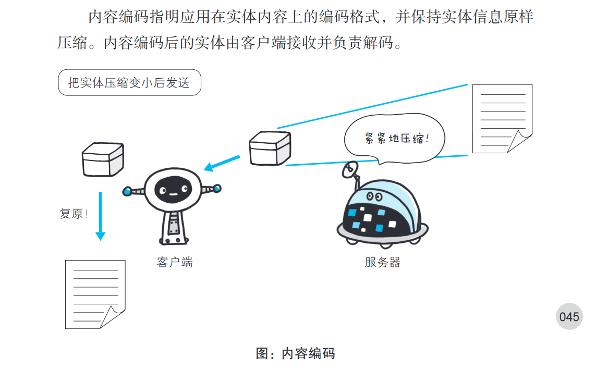
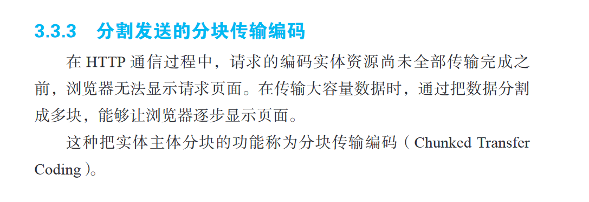
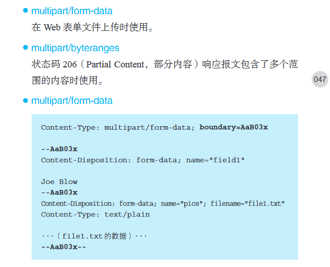
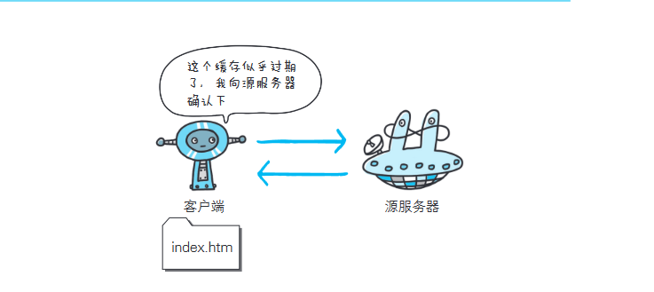
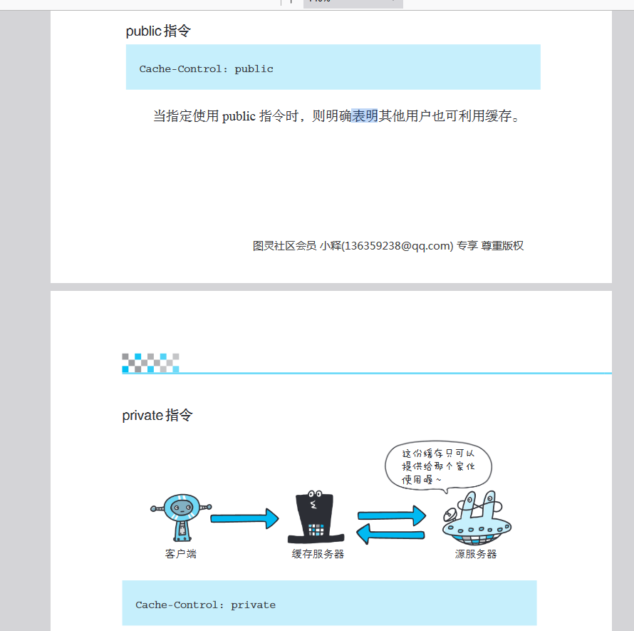

# 图解HTTP

    管线化（其实就是异步请求，不用同步请求，不用上一个请求完再请求下一个）

    
    报文主体等于实体主体。只有当传输中进行编码操作时，实体主体的内容发生变化，才导致他和报文主体产生差异

    
    其实编码就是压缩
    
 
    常见内容编码有
        gzip
        compress  unix系统的标准压缩
        deflate zlib
        identity  不进行编码 ！！！

    能把实体主体分块的功能称为分块传输编码



    http 1.1 存在一种称为传输编码的机制，他可以在通信时按照某种编码方式传输，但只定义作用于分块传输编码中
    分块传输编码的工作流程
    服务器响应头：服务器在响应中会包含一个 Transfer-Encoding: chunked 的标头，告诉客户端接下来的内容会以分块的方式传输。
    数据分块：
    每个数据块由两部分组成：块大小（以十六进制表示）和实际数据。块大小标明了当前数据块的字节长度。
    在块大小之后是实际的数据内容。
    传输的最后一个块是一个大小为 0 的块，表示数据传输结束。
    客户端解析：客户端收到数据后，会根据每个块的大小逐块读取数据，并在最后一个块到达时结束读取。

```
axios({
    method: 'get',
    url: 'https://example.com/large-file',  // 替换为实际的 URL
    responseType: 'stream'
})
.then(response => {
    response.data.on('data', (chunk) => {
        console.log('Received chunk:', chunk.toString());  // 处理每个数据块
    });

    response.data.on('end', () => {
        console.log('Stream ended.');
    });
})
.catch(error => {
    console.error('Error during request:', error);
});

```

    发送多种数据的多部分对象集合
        发送邮件时，我们可以在邮件里写入文字并添加多份附件。这是因
        为采用了 MIME（Multipurpose Internet Mail Extensions，多用途因特网
        邮件扩展）机制，它允许邮件处理文本、图片、视频等多个不同类型的
        数据。例如，图片等二进制数据以 ASCII 码字符串编码的方式指明，就
        是利用 MIME 来描述标记数据类型。而在 MIME 扩展中会使用一种称
        为多部分对象集合（Multipart）的方法，来容纳多份不同类型的数据。

    相应地，HTTP 协议中也采纳了多部分对象集合，发送的一份报文主体内可含有多类型实体。通常是在图片或文本文件等上传时使用。
        多部分对象集合包含的对象如下。


    获取部分内容的范围请求
        以前，用户不能使用现在这种高速的带宽访问互联网，当时，下载
        一个尺寸稍大的图片或文件就已经很吃力了。如果下载过程中遇到网络
        中断的情况，那就必须重头开始。为了解决上述问题，需要一种可恢复
        的机制。所谓恢复是指能从之前下载中断处恢复下载。
        要实现该功能需要指定下载的实体范围。像这样，指定范围发送的
        请求叫做范围请求（Range Request）。
        对一份 10 000 字节大小的资源，如果使用范围请求，可以只请求
        5001~10 000 字节内的资源。

    
    如果服务器端无法相应范围请求，则会返回状态码200 和完整的实体内容
    axios操作定义请求头
    responseType: 'stream',
    headers: {
        'Range': `bytes=${downloadedSize}-`  // 从已下载字节数继续请求
    }
    

    缓存不仅可以存在缓存服务器内，还可以存在客户端浏览器中， 以IE为例，把客户端缓存称为临时网络文件
    浏览器缓存如果有效，就不必再想服务器请求相同的资源了，可以直接从本地磁盘内读取
    另外，和缓存服务器相同的一点是，当判定缓存过期后，会向服务器确认资源的有效性，若判断浏览器缓存失效，浏览器会再次请求新资源


    从字面意思上很容易把 no-cache 误解成为不缓存，但事实上 no-cache 代表不
    缓存过期的资源，缓存会向源服务器进行有效期确认后处理资源，也许称为
    do-not-serve-from-cache-without-revalidation 更合适。no-store 才是真正地不进
    行缓存，请读者注意区别理解。

    http有四种http首部字段类型
        HTTP首部字段根据实际用途被分为以下4种类型
        1.通用首部字段：请求报文和响应报文都会使用的首部
            Cache-Control 操作缓存的工作机制
                缓存请求指令
                no-cache：强制向服务器再次验证，哪怕有缓存也要再次验证，不立即使用缓存要验证
                no-store：不缓存请求或响应的任何内容
                max-age=【秒】：响应的最大age值  强调缓存资源的最大生命周期，用于控制缓存资源的生效时间。
                max-stale=【秒】：接收已过期的响应  Cache-Control: max-stale=60 表示客户端可以接受最多过期 60 秒的响应。  允许使用已过期的资源，适用于对时效性要求不高或网络状况不佳时。
                min-fresh=【秒】：期望在指定时间内的响应仍有效   强调资源在未来一定时间内的有效性，适用于对时效性要求高的场景。
                no-transform：代理不可更改媒体类型
                only-if-cached：从缓存获取资源
                    cache-extension 指令通常附加在 Cache-Control 头中，与标准指令一起使用
                    Cache-Control: max-age=3600, my-extension=custom-value
                    其中 my-extension=custom-value 就是一个 cache-extension，它定义了一个名为 my-extension 的自定义缓存行为。

                缓存响应指令
                privite
                public



                


        2.请求首部字段：从客户端向服务器发送请求报文时使用的首部，补充了请求的附加信息，客户端信息，响应内容相关优先级等信息
        3.响应首部字段：从服务端向客户端返回响应报文时使用的首部，补充了响应的附加内容，也会要求客户端附加额外的内容信息
        4.实体首部字段：针对请求报文和响应报文的实体部分使用的首部，补充了资源内容更新时间等与实体有关的信息