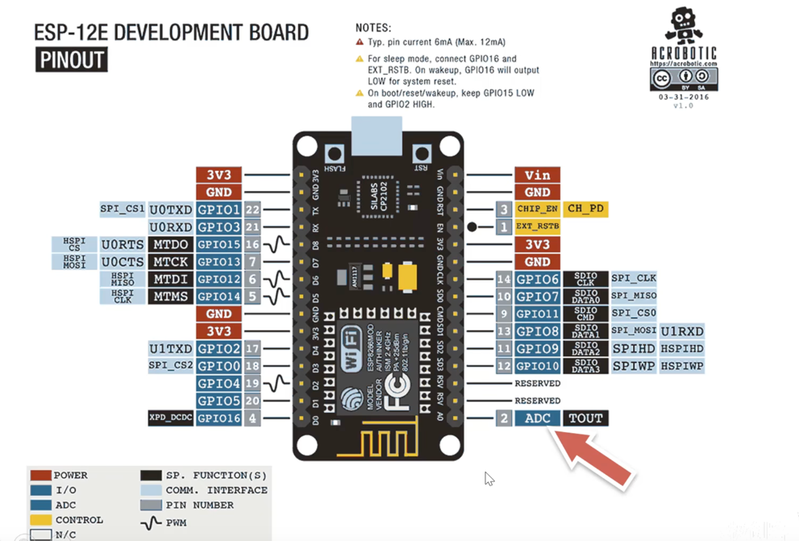
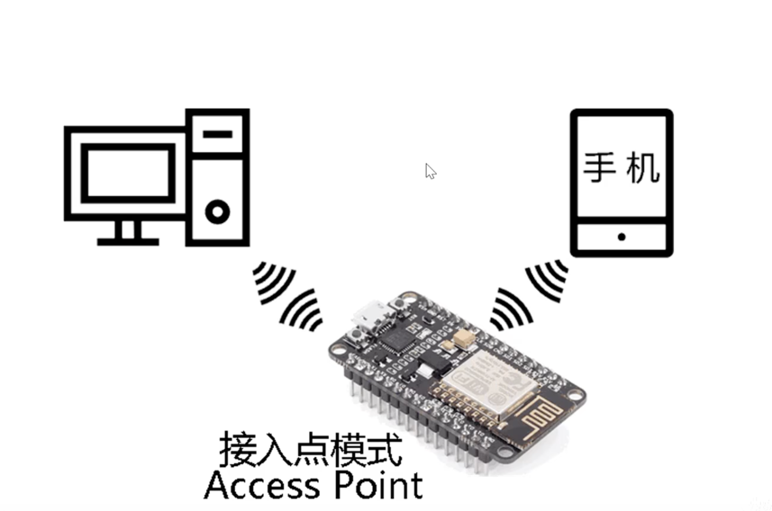
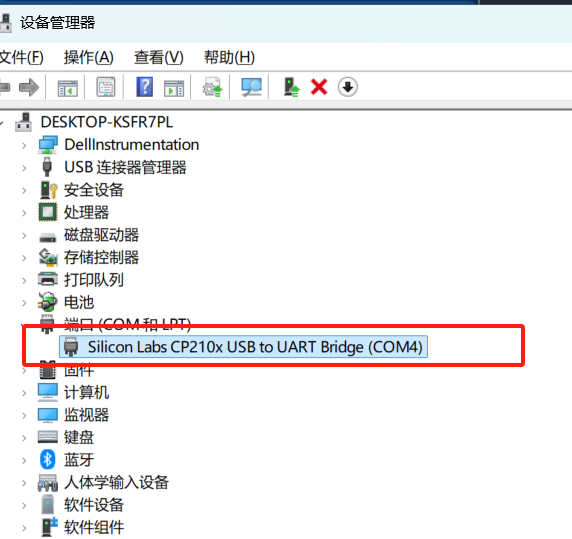
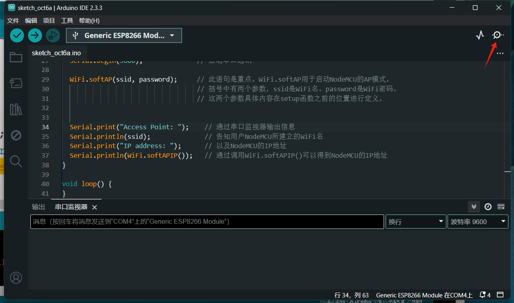

# 物联网（IOT）

课程预备知识
    微控制器的基本知识
    Arduino开发基本操作
    电路基础
    C语言开发基本知识

本次项目使用ESP8266-NodeMCU 开发板  ----- 适合初学者开发和学习使用
这个开发板可使用Arduino开发环境，也可以使用其他的开发环境
开源资源十分丰富
使用多用开发环境 C C++  Micropython，Lua
性能稳定 价格亲民

> internet of things 物联网


## 开发板详解

ESP8266-NodeMCU 开发板是一个开源的


数字引脚：只接受或输出 高（1） 和 低（0） 两种状态，用于控制开关类的设备或与数字传感器交互。
模拟引脚：可以读取或输出连续的电压值，常用于处理模拟信号或传感器的连续数据。

实际应用：
	•	数字引脚：读取按钮状态、控制 LED、驱动继电器等。
	•	模拟引脚：读取传感器数据，如温度、光照强度、电位器值等。 

数字引脚电压是3.3V
模拟引脚可读取电压范围0-1V 

Wifi是链路层协议中的一种

接入点模式：8266可以发射一个wifi网络 别人可以连接

无线终端模式：8266当做一个设备

混合模式：


>http://www.taichi-maker.com/homepage/esp8266-nodemcu-iot/iot-c/esp8266-iot-basics/

## NodeMCU驱动下载
> https://cn.silabs.com/developers/usb-to-uart-bridge-vcp-drivers
为芯片驱动下载了就可以连接开发板了用USB线

下载第一个就可以
下载好后 如果发现没有.exe执行文件 ，找到inf文件 右键有安装 也可以进行安装

## 使用USB线将电脑和开发板进行连接
进入windows电脑的设备管理器


## 为开发板搭建Arduino IDE开发环境
> https://www.arduino.cc/en/software

安装完成后打开首选项
配置其他开发板管理配置里面填
> http://arduino.esp8266.com/stable/package_esp8266com_index.json

然后确认
然后点击工具-->开发板-->开发板管理器

下载并安装
然后工具——>开发板选esp8266的 然后端口选好 

然后文件-->实例-->选bink来编译进行测试

## MCU设置wifi接入点模式
```c++
/*
NodeMCU接入点模式
By 太极创客（http://www.taichi-maker.com）
2019-03-11
 
此程序用于演示如何将NodeMCU以接入点模式工作。通过此程序，您可以使用
电脑或者手机连接NodeMCU所建立WiFi网络。
 
网络名: taichi-maker
密码：12345678
 
如需获得更多关于如何使用NodeMCU开发物联网的教程和资料信息
请参考太极创客网站（http://www.taichi-maker.com）
并在首页搜索栏中搜索关键字：物联网
*/
 
#include <ESP8266WiFi.h>        // 本程序使用ESP8266WiFi库
 
const char *ssid = "taichi-maker"; // 这里定义将要建立的WiFi名称。此处以"taichi-maker"为示例
                                   // 您可以将自己想要建立的WiFi名称填写入此处的双引号中
 
const char *password = "12345678";  // 这里定义将要建立的WiFi密码。此处以12345678为示例
                                    // 您可以将自己想要使用的WiFi密码放入引号内
                                    // 如果建立的WiFi不要密码，则在双引号内不要填入任何信息
 
void setup() {
  Serial.begin(9600);              // 启动串口通讯
 
  WiFi.softAP(ssid, password);     // 此语句是重点。WiFi.softAP用于启动NodeMCU的AP模式。
                                   // 括号中有两个参数，ssid是WiFi名。password是WiFi密码。
                                   // 这两个参数具体内容在setup函数之前的位置进行定义。
 
  
  Serial.print("Access Point: ");    // 通过串口监视器输出信息
  Serial.println(ssid);              // 告知用户NodeMCU所建立的WiFi名
  Serial.print("IP address: ");      // 以及NodeMCU的IP地址
  Serial.println(WiFi.softAPIP());   // 通过调用WiFi.softAPIP()可以得到NodeMCU的IP地址
}
 
void loop() { 
}
```


然后ping 192.168.4.1 会发现能ping通 因为默认的ip地址是这个

这个是串口监视器，可以把代码中打印的东西展示出来，但是MCU需要手动嗯下rst 才会重新执行里面的代码
摁下之后就会有这样的东西


> 如果打印出现乱码 网友说是修改下波特率就可以 改成960 但我没测试

## MCU设置无线终端模式
```c++
/*
NodeMCU无线终端模式连接WiFi
By 太极创客（http://www.taichi-maker.com）
2019-03-11
 
本示例程序用于演示如何使用NodeMCU无线终端模式连接WiFi
 
如需获得更多关于如何使用NodeMCU开发物联网的教程和资料信息
请参考太极创客网站（http://www.taichi-maker.com）
并在首页搜索栏中搜索关键字：物联网
*/
 
#include <ESP8266WiFi.h>        // 本程序使用ESP8266WiFi库
 
const char* ssid     = "taichi-maker";      // 连接WiFi名（此处使用taichi-maker为示例）
                                            // 请将您需要连接的WiFi名填入引号中
const char* password = "12345678";          // 连接WiFi密码（此处使用12345678为示例）
                                            // 请将您需要连接的WiFi密码填入引号中
                                            
void setup() {
  Serial.begin(9600);         // 启动串口通讯
  
  WiFi.begin(ssid, password);                  // 启动网络连接
  Serial.print("Connecting to ");              // 串口监视器输出网络连接信息
  Serial.print(ssid); Serial.println(" ...");  // 告知用户NodeMCU正在尝试WiFi连接
  
  int i = 0;                                   // 这一段程序语句用于检查WiFi是否连接成功
  while (WiFi.status() != WL_CONNECTED) {      // WiFi.status()函数的返回值是由NodeMCU的WiFi连接状态所决定的。 
    delay(1000);                               // 如果WiFi连接成功则返回值为WL_CONNECTED                       
    Serial.print(i++); Serial.print(' ');      // 此处通过While循环让NodeMCU每隔一秒钟检查一次WiFi.status()函数返回值
  }                                            // 同时NodeMCU将通过串口监视器输出连接时长读秒。
                                               // 这个读秒是通过变量i每隔一秒自加1来实现的。
                                               
  Serial.println("");                          // WiFi连接成功后
  Serial.println("Connection established!");   // NodeMCU将通过串口监视器输出"连接成功"信息。
  Serial.print("IP address:    ");             // 同时还将输出NodeMCU的IP地址。这一功能是通过调用
  Serial.println(WiFi.localIP());              // WiFi.localIP()函数来实现的。该函数的返回值即NodeMCU的IP地址。
}
 
void loop() {                                   
}

```
结果也很成功

至此开发板已经可以连接互联网了

自动连接最强信号WiFi网络
```c++
/*
NodeMCU无线终端模式连接WiFi-2
By 太极创客（http://www.taichi-maker.com）
2019-03-11
 
此程序将会控制NodeMCU在当前的网络环境里搜索预先存储好的WiFi。
一旦找到预存的WiFi名称，NodeMCU将会使用预存的密码信息尝试连接该WiFi。
如果同时找到多个预存WiFi，NodeMCU将会尝试连接信号最强的WiFi。
 
如需获得更多关于如何使用NodeMCU开发物联网的教程和资料信息
请参考太极创客网站（http://www.taichi-maker.com）
并在首页搜索栏中搜索关键字：物联网
*/
 
#include <ESP8266WiFi.h>          // 本程序使用ESP8266WiFi库
#include <ESP8266WiFiMulti.h>   // 本程序使用ESP8266WiFiMulti库
 
ESP8266WiFiMulti wifiMulti;     // 建立ESP8266WiFiMulti对象,对象名称是'wifiMulti'
 
void setup() {
  Serial.begin(9600);            // 启动串口通讯
 
//通过addAp函数存储  WiFi名称       WiFi密码
  wifiMulti.addAP("taichi-maker", "12345678");  // 这三条语句通过调用函数addAP来记录3个不同的WiFi网络信息。
  wifiMulti.addAP("taichi-maker2", "87654321"); // 这3个WiFi网络名称分别是taichi-maker, taichi-maker2, taichi-maker3。
  wifiMulti.addAP("taichi-maker3", "13572468"); // 这3个网络的密码分别是123456789，87654321，13572468。
                                                // 此处WiFi信息只是示例，请在使用时将需要连接的WiFi信息填入相应位置。
                                                // 另外这里只存储了3个WiFi信息，您可以存储更多的WiFi信息在此处。
                                                
  Serial.println("Connecting ...");         // 通过串口监视器输出信息告知用户NodeMCU正在尝试连接WiFi
  int i = 0;                                 
  while (wifiMulti.run() != WL_CONNECTED) {  // 此处的wifiMulti.run()是重点。通过wifiMulti.run()，NodeMCU将会在当前
    delay(1000);                             // 环境中搜索addAP函数所存储的WiFi。如果搜到多个存储的WiFi那么NodeMCU
    Serial.print('.');                       // 将会连接信号最强的那一个WiFi信号。
  }                                           // 一旦连接WiFI成功，wifiMulti.run()将会返回“WL_CONNECTED”。这也是
                                              // 此处while循环判断是否跳出循环的条件。
 
  
  Serial.println('\n');                     // WiFi连接成功后
  Serial.print("Connected to ");            // NodeMCU将通过串口监视器输出。
  Serial.println(WiFi.SSID());              // 连接的WiFI名称
  Serial.print("IP address:\t");            // 以及
  Serial.println(WiFi.localIP());           // NodeMCU的IP地址
}
 
void loop() { 
}


```