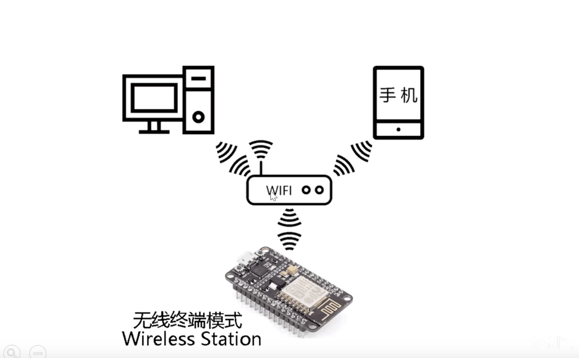
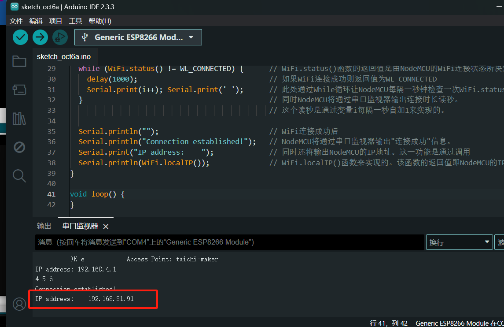
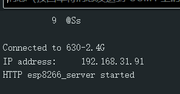
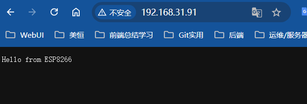

# 物联网（IOT）

课程预备知识
    微控制器的基本知识
    Arduino开发基本操作
    电路基础
    C语言开发基本知识

本次项目使用ESP8266-NodeMCU 开发板  ----- 适合初学者开发和学习使用
这个开发板可使用Arduino开发环境，也可以使用其他的开发环境
开源资源十分丰富
使用多用开发环境 C C++  Micropython，Lua
性能稳定 价格亲民

> internet of things 物联网


## 开发板详解

ESP8266-NodeMCU 开发板是一个开源的


数字引脚：只接受或输出 高（1） 和 低（0） 两种状态，用于控制开关类的设备或与数字传感器交互。
模拟引脚：可以读取或输出连续的电压值，常用于处理模拟信号或传感器的连续数据。

实际应用：
	•	数字引脚：读取按钮状态、控制 LED、驱动继电器等。
	•	模拟引脚：读取传感器数据，如温度、光照强度、电位器值等。 

数字引脚电压是3.3V
模拟引脚可读取电压范围0-1V 

Wifi是链路层协议中的一种

接入点模式：8266可以发射一个wifi网络 别人可以连接

无线终端模式：8266当做一个设备

混合模式：


>http://www.taichi-maker.com/homepage/esp8266-nodemcu-iot/iot-c/esp8266-iot-basics/

## NodeMCU驱动下载
> https://cn.silabs.com/developers/usb-to-uart-bridge-vcp-drivers
为芯片驱动下载了就可以连接开发板了用USB线

下载第一个就可以
下载好后 如果发现没有.exe执行文件 ，找到inf文件 右键有安装 也可以进行安装

## 使用USB线将电脑和开发板进行连接
进入windows电脑的设备管理器


## 为开发板搭建Arduino IDE开发环境
> https://www.arduino.cc/en/software

安装完成后打开首选项
配置其他开发板管理配置里面填
> http://arduino.esp8266.com/stable/package_esp8266com_index.json

然后确认
然后点击工具-->开发板-->开发板管理器

下载并安装
然后工具——>开发板选esp8266的 然后端口选好 

然后文件-->实例-->选bink来编译进行测试

## MCU设置wifi接入点模式
```c++
/*
NodeMCU接入点模式
By 太极创客（http://www.taichi-maker.com）
2019-03-11
 
此程序用于演示如何将NodeMCU以接入点模式工作。通过此程序，您可以使用
电脑或者手机连接NodeMCU所建立WiFi网络。
 
网络名: taichi-maker
密码：12345678
 
如需获得更多关于如何使用NodeMCU开发物联网的教程和资料信息
请参考太极创客网站（http://www.taichi-maker.com）
并在首页搜索栏中搜索关键字：物联网
*/
 
#include <ESP8266WiFi.h>        // 本程序使用ESP8266WiFi库
 
const char *ssid = "taichi-maker"; // 这里定义将要建立的WiFi名称。此处以"taichi-maker"为示例
                                   // 您可以将自己想要建立的WiFi名称填写入此处的双引号中
 
const char *password = "12345678";  // 这里定义将要建立的WiFi密码。此处以12345678为示例
                                    // 您可以将自己想要使用的WiFi密码放入引号内
                                    // 如果建立的WiFi不要密码，则在双引号内不要填入任何信息
 
void setup() {
  Serial.begin(9600);              // 启动串口通讯
 
  WiFi.softAP(ssid, password);     // 此语句是重点。WiFi.softAP用于启动NodeMCU的AP模式。
                                   // 括号中有两个参数，ssid是WiFi名。password是WiFi密码。
                                   // 这两个参数具体内容在setup函数之前的位置进行定义。
 
  
  Serial.print("Access Point: ");    // 通过串口监视器输出信息
  Serial.println(ssid);              // 告知用户NodeMCU所建立的WiFi名
  Serial.print("IP address: ");      // 以及NodeMCU的IP地址
  Serial.println(WiFi.softAPIP());   // 通过调用WiFi.softAPIP()可以得到NodeMCU的IP地址
}
 
void loop() { 
}
```


然后ping 192.168.4.1 会发现能ping通 因为默认的ip地址是这个

这个是串口监视器，可以把代码中打印的东西展示出来，但是MCU需要手动嗯下rst 才会重新执行里面的代码
摁下之后就会有这样的东西


> 如果打印出现乱码 网友说是修改下波特率就可以 改成960 但我没测试

## MCU设置无线终端模式
```c++
/*
NodeMCU无线终端模式连接WiFi
By 太极创客（http://www.taichi-maker.com）
2019-03-11
 
本示例程序用于演示如何使用NodeMCU无线终端模式连接WiFi
 
如需获得更多关于如何使用NodeMCU开发物联网的教程和资料信息
请参考太极创客网站（http://www.taichi-maker.com）
并在首页搜索栏中搜索关键字：物联网
*/
 
#include <ESP8266WiFi.h>        // 本程序使用ESP8266WiFi库
 
const char* ssid     = "taichi-maker";      // 连接WiFi名（此处使用taichi-maker为示例）
                                            // 请将您需要连接的WiFi名填入引号中
const char* password = "12345678";          // 连接WiFi密码（此处使用12345678为示例）
                                            // 请将您需要连接的WiFi密码填入引号中
                                            
void setup() {
  Serial.begin(9600);         // 启动串口通讯
  
  WiFi.begin(ssid, password);                  // 启动网络连接
  Serial.print("Connecting to ");              // 串口监视器输出网络连接信息
  Serial.print(ssid); Serial.println(" ...");  // 告知用户NodeMCU正在尝试WiFi连接
  
  int i = 0;                                   // 这一段程序语句用于检查WiFi是否连接成功
  while (WiFi.status() != WL_CONNECTED) {      // WiFi.status()函数的返回值是由NodeMCU的WiFi连接状态所决定的。 
    delay(1000);                               // 如果WiFi连接成功则返回值为WL_CONNECTED                       
    Serial.print(i++); Serial.print(' ');      // 此处通过While循环让NodeMCU每隔一秒钟检查一次WiFi.status()函数返回值
  }                                            // 同时NodeMCU将通过串口监视器输出连接时长读秒。
                                               // 这个读秒是通过变量i每隔一秒自加1来实现的。
                                               
  Serial.println("");                          // WiFi连接成功后
  Serial.println("Connection established!");   // NodeMCU将通过串口监视器输出"连接成功"信息。
  Serial.print("IP address:    ");             // 同时还将输出NodeMCU的IP地址。这一功能是通过调用
  Serial.println(WiFi.localIP());              // WiFi.localIP()函数来实现的。该函数的返回值即NodeMCU的IP地址。
}
 
void loop() {                                   
}

```
结果也很成功

至此开发板已经可以连接互联网了

自动连接最强信号WiFi网络
```c++
/*
NodeMCU无线终端模式连接WiFi-2
By 太极创客（http://www.taichi-maker.com）
2019-03-11
 
此程序将会控制NodeMCU在当前的网络环境里搜索预先存储好的WiFi。
一旦找到预存的WiFi名称，NodeMCU将会使用预存的密码信息尝试连接该WiFi。
如果同时找到多个预存WiFi，NodeMCU将会尝试连接信号最强的WiFi。
 
如需获得更多关于如何使用NodeMCU开发物联网的教程和资料信息
请参考太极创客网站（http://www.taichi-maker.com）
并在首页搜索栏中搜索关键字：物联网
*/
 
#include <ESP8266WiFi.h>          // 本程序使用ESP8266WiFi库
#include <ESP8266WiFiMulti.h>   // 本程序使用ESP8266WiFiMulti库
 
ESP8266WiFiMulti wifiMulti;     // 建立ESP8266WiFiMulti对象,对象名称是'wifiMulti'
 
void setup() {
  Serial.begin(9600);            // 启动串口通讯
 
//通过addAp函数存储  WiFi名称       WiFi密码
  wifiMulti.addAP("taichi-maker", "12345678");  // 这三条语句通过调用函数addAP来记录3个不同的WiFi网络信息。
  wifiMulti.addAP("taichi-maker2", "87654321"); // 这3个WiFi网络名称分别是taichi-maker, taichi-maker2, taichi-maker3。
  wifiMulti.addAP("taichi-maker3", "13572468"); // 这3个网络的密码分别是123456789，87654321，13572468。
                                                // 此处WiFi信息只是示例，请在使用时将需要连接的WiFi信息填入相应位置。
                                                // 另外这里只存储了3个WiFi信息，您可以存储更多的WiFi信息在此处。
                                                
  Serial.println("Connecting ...");         // 通过串口监视器输出信息告知用户NodeMCU正在尝试连接WiFi
  int i = 0;                                 
  while (wifiMulti.run() != WL_CONNECTED) {  // 此处的wifiMulti.run()是重点。通过wifiMulti.run()，NodeMCU将会在当前
    delay(1000);                             // 环境中搜索addAP函数所存储的WiFi。如果搜到多个存储的WiFi那么NodeMCU
    Serial.print('.');                       // 将会连接信号最强的那一个WiFi信号。
  }                                           // 一旦连接WiFI成功，wifiMulti.run()将会返回“WL_CONNECTED”。这也是
                                              // 此处while循环判断是否跳出循环的条件。
 
  
  Serial.println('\n');                     // WiFi连接成功后
  Serial.print("Connected to ");            // NodeMCU将通过串口监视器输出。
  Serial.println(WiFi.SSID());              // 连接的WiFI名称
  Serial.print("IP address:\t");            // 以及
  Serial.println(WiFi.localIP());           // NodeMCU的IP地址
}
 
void loop() { 
}

```

## 使用NodeMCU搭建网络服务器  可以提供网页服务
可以通过网页控制开开发  开发板是以无线终端的模式启动的
1. 建立基本网络服务器
```c++

/**********************************************************************
项目名称/Project          : 零基础入门学用物联网
程序名称/Program name     : 3_2_1_First_Web_Server
团队/Team                : 太极创客团队 / Taichi-Maker (www.taichi-maker.com)
作者/Author              : CYNO朔
日期/Date（YYYYMMDD）     : 20191107
程序目的/Purpose          : 使用NodeMCU建立基本服务器。用户可通过浏览器使用8266的IP地址
                           访问8266所建立的基本网页（Hello from ESP8266）
-----------------------------------------------------------------------
修订历史/Revision History  
日期/Date    作者/Author      参考号/Ref    修订说明/Revision Description
 
***********************************************************************/
#include <ESP8266WiFi.h>        // 本程序使用 ESP8266WiFi库
#include <ESP8266WiFiMulti.h>   //  ESP8266WiFiMulti库
#include <ESP8266WebServer.h>   //  ESP8266WebServer库
 
ESP8266WiFiMulti wifiMulti;     // 建立ESP8266WiFiMulti对象,对象名称是'wifiMulti'
 
ESP8266WebServer esp8266_server(80);// 建立ESP8266WebServer对象，对象名称为esp8266_server
                                    // 括号中的数字是网路服务器响应http请求的端口号
                                    // 网络服务器标准http端口号为80，因此这里使用80为端口号
 
void setup(void){
  Serial.begin(9600);          // 启动串口通讯
 
  //通过addAp函数存储  WiFi名称       WiFi密码
  wifiMulti.addAP("taichi-maker", "12345678");  // 这三条语句通过调用函数addAP来记录3个不同的WiFi网络信息。
  wifiMulti.addAP("taichi-maker2", "87654321"); // 这3个WiFi网络名称分别是taichi-maker, taichi-maker2, taichi-maker3。
  wifiMulti.addAP("taichi-maker3", "13572468"); // 这3个网络的密码分别是123456789，87654321，13572468。
                                                // 此处WiFi信息只是示例，请在使用时将需要连接的WiFi信息填入相应位置。
                                                // 另外这里只存储了3个WiFi信息，您可以存储更多的WiFi信息在此处。
 
  int i = 0;                                 
  while (wifiMulti.run() != WL_CONNECTED) {  // 此处的wifiMulti.run()是重点。通过wifiMulti.run()，NodeMCU将会在当前
    delay(1000);                             // 环境中搜索addAP函数所存储的WiFi。如果搜到多个存储的WiFi那么NodeMCU
    Serial.print(i++); Serial.print(' ');    // 将会连接信号最强的那一个WiFi信号。
  }                                          // 一旦连接WiFI成功，wifiMulti.run()将会返回“WL_CONNECTED”。这也是
                                             // 此处while循环判断是否跳出循环的条件。
 
  // WiFi连接成功后将通过串口监视器输出连接成功信息 
  Serial.println('\n');                     // WiFi连接成功后
  Serial.print("Connected to ");            // NodeMCU将通过串口监视器输出。
  Serial.println(WiFi.SSID());              // 连接的WiFI名称
  Serial.print("IP address:\t");            // 以及
  Serial.println(WiFi.localIP());           // NodeMCU的IP地址
  
//--------"启动网络服务功能"程序部分开始-------- //  此部分为程序为本示例程序重点1
  esp8266_server.begin();                   //  详细讲解请参见太极创客网站《零基础入门学用物联网》
  esp8266_server.on("/", handleRoot);       //  第3章-第2节 ESP8266-NodeMCU网络服务器-1
  esp8266_server.onNotFound(handleNotFound);        
//--------"启动网络服务功能"程序部分结束--------
  Serial.println("HTTP esp8266_server started");//  告知用户ESP8266网络服务功能已经启动
}
 
/* 以下函数语句为本示例程序重点3
详细讲解请参见太极创客网站《零基础入门学用物联网》
第3章-第2节 3_2_1_First_Web_Server 的说明讲解*/  
void loop(void){
  esp8266_server.handleClient();     // 处理http服务器访问
}
 
/* 以下两个函数为本示例程序重点2
详细讲解请参见太极创客网站《零基础入门学用物联网》
第3章-第2节 3_2_1_First_Web_Server 的说明讲解*/                                                                            
void handleRoot() {   //处理网站根目录“/”的访问请求 
  esp8266_server.send(200, "text/plain", "Hello from ESP8266");   // NodeMCU将调用此函数。
}
 
// 设置处理404情况的函数'handleNotFound'
void handleNotFound(){                                        // 当浏览器请求的网络资源无法在服务器找到时，
  esp8266_server.send(404, "text/plain", "404: Not found");   // NodeMCU将调用此函数。
} 

```
上传成功后访问MCU ip就可以访问了



2. 通过网络服务实现MCU开发板的基本控制
```c++

/**********************************************************************
项目名称/Project          : 零基础入门学用物联网
程序名称/Program name     : 3_2_2_Turning_on_and_off_an_LED
团队/Team                : 太极创客团队 / Taichi-Maker (www.taichi-maker.com)
作者/Author              : CYNO朔
日期/Date（YYYYMMDD）     : 20191108
程序目的/Purpose          : 使用NodeMCU建立基本服务器。用户可通过浏览器使用8266的IP地址
                           访问8266所建立的基本网页并通过该页面点亮/熄灭NodeMCU的内置LED
-----------------------------------------------------------------------
修订历史/Revision History  
日期/Date    作者/Author      参考号/Ref    修订说明/Revision Description
 
***********************************************************************/
#include <ESP8266WiFi.h>        // 本程序使用 ESP8266WiFi库
#include <ESP8266WiFiMulti.h>   //  ESP8266WiFiMulti库
#include <ESP8266WebServer.h>   //  ESP8266WebServer库
 
ESP8266WiFiMulti wifiMulti;     // 建立ESP8266WiFiMulti对象,对象名称是 'wifiMulti'
 
ESP8266WebServer esp8266_server(80);// 建立网络服务器对象，该对象用于响应HTTP请求。监听端口（80）
 
void setup(void){
  Serial.begin(9600);   // 启动串口通讯
 
  pinMode(LED_BUILTIN, OUTPUT); //设置内置LED引脚为输出模式以便控制LED
  
  wifiMulti.addAP("ssid_from_AP_1", "your_password_for_AP_1"); // 将需要连接的一系列WiFi ID和密码输入这里
  wifiMulti.addAP("ssid_from_AP_2", "your_password_for_AP_2"); // ESP8266-NodeMCU再启动后会扫描当前网络
  wifiMulti.addAP("ssid_from_AP_3", "your_password_for_AP_3"); // 环境查找是否有这里列出的WiFi ID。如果有
  Serial.println("Connecting ...");                            // 则尝试使用此处存储的密码进行连接。
  
  int i = 0;                                 
  while (wifiMulti.run() != WL_CONNECTED) {  // 此处的wifiMulti.run()是重点。通过wifiMulti.run()，NodeMCU将会在当前
    delay(1000);                             // 环境中搜索addAP函数所存储的WiFi。如果搜到多个存储的WiFi那么NodeMCU
    Serial.print(i++); Serial.print(' ');    // 将会连接信号最强的那一个WiFi信号。
  }                                          // 一旦连接WiFI成功，wifiMulti.run()将会返回“WL_CONNECTED”。这也是
                                             // 此处while循环判断是否跳出循环的条件。
  
  // WiFi连接成功后将通过串口监视器输出连接成功信息 
  Serial.println('\n');
  Serial.print("Connected to ");
  Serial.println(WiFi.SSID());              // 通过串口监视器输出连接的WiFi名称
  Serial.print("IP address:\t");
  Serial.println(WiFi.localIP());           // 通过串口监视器输出ESP8266-NodeMCU的IP
 
  esp8266_server.begin();                           // 启动网站服务
  esp8266_server.on("/", HTTP_GET, handleRoot);     // 设置服务器根目录即'/'的函数'handleRoot'
  esp8266_server.on("/LED", HTTP_POST, handleLED);  // 设置处理LED控制请求的函数'handleLED'
  esp8266_server.onNotFound(handleNotFound);        // 设置处理404情况的函数'handleNotFound'
 
  Serial.println("HTTP esp8266_server started");//  告知用户ESP8266网络服务功能已经启动
}
 
void loop(void){
  esp8266_server.handleClient();                     // 检查http服务器访问
}
 
/*设置服务器根目录即'/'的函数'handleRoot'
  该函数的作用是每当有客户端访问NodeMCU服务器根目录时，
  NodeMCU都会向访问设备发送 HTTP 状态 200 (Ok) 这是send函数的第一个参数。
  同时NodeMCU还会向浏览器发送HTML代码，以下示例中send函数中第三个参数，
  也就是双引号中的内容就是NodeMCU发送的HTML代码。该代码可在网页中产生LED控制按钮。 
  当用户按下按钮时，浏览器将会向NodeMCU的/LED页面发送HTTP请求，请求方式为POST。
  NodeMCU接收到此请求后将会执行handleLED函数内容*/
void handleRoot() {       
  esp8266_server.send(200, "text/html", "<form action=\"/LED\" method=\"POST\"><input type=\"submit\" value=\"Toggle LED\"></form>");
}
 
//处理LED控制请求的函数'handleLED'
void handleLED() {                          
  digitalWrite(LED_BUILTIN,!digitalRead(LED_BUILTIN));// 改变LED的点亮或者熄灭状态
  esp8266_server.sendHeader("Location","/");          // 跳转回页面根目录
  esp8266_server.send(303);                           // 发送Http相应代码303 跳转  
}
 
// 设置处理404情况的函数'handleNotFound'
void handleNotFound(){
  esp8266_server.send(404, "text/plain", "404: Not found"); // 发送 HTTP 状态 404 (未找到页面) 并向浏览器发送文字 "404: Not found"
} 

```

3. 通过网络服务把开发板引脚状态显示在页面上
我们经常会在开发板上连接各种传感器，引脚里面有传感器的状态
开发板的flash按钮 会控制D3引脚的状态 
```c++

/**********************************************************************
项目名称/Project          : 零基础入门学用物联网
程序名称/Program name     : 3_2_3_Pin_State_Display
团队/Team                : 太极创客团队 / Taichi-Maker (www.taichi-maker.com)
作者/Author              : CYNO朔
日期/Date（YYYYMMDD）     : 20191107
程序目的/Purpose          : 使用NodeMCU建立基本服务器。该页面将会自动刷新并且显示NodeMCU
                           的D3引脚状态。NodeMCU开发板上的FLASH按键可以控制D3引脚的电平。
                           没有按下该按键时D3引脚将会保持高电平状态。当按下该按键后，
                           D3引脚会变为低电平。
-----------------------------------------------------------------------
修订历史/Revision History  
日期/Date    作者/Author      参考号/Ref    修订说明/Revision Description
***********************************************************************/
 
#include <ESP8266WiFi.h>        // 本程序使用 ESP8266WiFi库
#include <ESP8266WiFiMulti.h>   //  ESP8266WiFiMulti库
#include <ESP8266WebServer.h>   //  ESP8266WebServer库
 
#define buttonPin D3            // 按钮引脚D3
 
ESP8266WiFiMulti wifiMulti;     // 建立ESP8266WiFiMulti对象,对象名称是'wifiMulti'
 
ESP8266WebServer esp8266_server(80);// 建立网络服务器对象，该对象用于响应HTTP请求。监听端口（80）
 
bool pinState;  // 存储引脚状态用变量
 
void setup(){
  Serial.begin(9600);   // 启动串口通讯
 
  pinMode(buttonPin, INPUT_PULLUP); // 将按键引脚设置为输入上拉模式
 
  wifiMulti.addAP("ssid_from_AP_1", "your_password_for_AP_1"); // 将需要连接的一系列WiFi ID和密码输入这里
  wifiMulti.addAP("ssid_from_AP_2", "your_password_for_AP_2"); // ESP8266-NodeMCU再启动后会扫描当前网络
  wifiMulti.addAP("ssid_from_AP_3", "your_password_for_AP_3"); // 环境查找是否有这里列出的WiFi ID。如果有
  Serial.println("Connecting ...");                            // 则尝试使用此处存储的密码进行连接。
  
  int i = 0;                                 
  while (wifiMulti.run() != WL_CONNECTED) {  // 此处的wifiMulti.run()是重点。通过wifiMulti.run()，NodeMCU将会在当前
    delay(1000);                             // 环境中搜索addAP函数所存储的WiFi。如果搜到多个存储的WiFi那么NodeMCU
    Serial.print(i++); Serial.print(' ');    // 将会连接信号最强的那一个WiFi信号。
  }                                          // 一旦连接WiFI成功，wifiMulti.run()将会返回“WL_CONNECTED”。这也是
                                             // 此处while循环判断是否跳出循环的条件。
  // WiFi连接成功后将通过串口监视器输出连接成功信息 
  Serial.println('\n');                     // WiFi连接成功后
  Serial.print("Connected to ");            // NodeMCU将通过串口监视器输出。
  Serial.println(WiFi.SSID());              // 连接的WiFI名称
  Serial.print("IP address:\t");            // 以及
  Serial.println(WiFi.localIP());           // NodeMCU的IP地址
  
  esp8266_server.begin();                   // 启动网站服务                
  esp8266_server.on("/", handleRoot);       // 设置服务器根目录即'/'的函数'handleRoot'
  esp8266_server.onNotFound(handleNotFound);// 设置处理404情况的函数'handleNotFound'        
 
  Serial.println("HTTP esp8266_server started");//  告知用户ESP8266网络服务功能已经启动
}
 
void loop(){
  esp8266_server.handleClient();     // 处理http服务器访问
  pinState = digitalRead(buttonPin); // 获取引脚状态
}
 
/* 以下函数处理网站首页的访问请求。此函数为本示例程序重点1
详细讲解请参见太极创客网站《零基础入门学用物联网》
第3章-第2节“通过网络服务将开发板引脚状态显示在网页中”的说明讲解。*/                                                                       
void handleRoot() {   
  String displayPinState;                   // 存储按键状态的字符串变量
  
  if(pinState == HIGH){                     // 当按键引脚D3为高电平
    displayPinState = "Button State: HIGH"; // 字符串赋值高电平信息
  } else {                                  // 当按键引脚D3为低电平
    displayPinState = "Button State: LOW";  // 字符串赋值低电平信息
  }
  
  esp8266_server.send(200, "text/plain", displayPinState); 
                                            // 向浏览器发送按键状态信息  
}
 
// 设置处理404情况的函数'handleNotFound'
void handleNotFound(){                                        // 当浏览器请求的网络资源无法在服务器找到时，
  esp8266_server.send(404, "text/plain", "404: Not found");   // NodeMCU将调用此函数。
}
```
但是实操后发现，摁下那一次才显示low，之后就被恢复到high了，要一直摁着才会显示low
但是我们得需要手动刷新页面才会展示引脚的最新状态
下一步我们做不用刷新就可以动态展示的，也就是定时刷新
```c++

/**********************************************************************
项目名称/Project          : 零基础入门学用物联网
程序名称/Program name     : 3_2_4_Pin_State_Display_Auto_Refresh
团队/Team                : 太极创客团队 / Taichi-Maker (www.taichi-maker.com)
作者/Author              : CYNO朔
日期/Date（YYYYMMDD）     : 20200128
程序目的/Purpose          : 使用NodeMCU建立基本服务器。该网页将显示引脚D3状态。同时状态会
                           每隔5秒钟更新一次。
-----------------------------------------------------------------------
修订历史/Revision History  
日期/Date    作者/Author      参考号/Ref    修订说明/Revision Description
 
***********************************************************************/
 
#include <ESP8266WiFi.h>        // 本程序使用 ESP8266WiFi库
#include <ESP8266WiFiMulti.h>   //  ESP8266WiFiMulti库
#include <ESP8266WebServer.h>   //  ESP8266WebServer库
 
#define buttonPin D3            // 按钮引脚D3
 
ESP8266WiFiMulti wifiMulti;     // 建立ESP8266WiFiMulti对象,对象名称是'wifiMulti'
 
ESP8266WebServer esp8266_server(80);// 建立网络服务器对象，该对象用于响应HTTP请求。监听端口（80）
 
bool pinState;                      // 存储引脚状态用变量
 
void setup(){
  Serial.begin(9600);          // 启动串口通讯
  delay(10);
  Serial.println("");
 
  pinMode(buttonPin, INPUT_PULLUP); // 将按键引脚设置为输入上拉模式
 
  wifiMulti.addAP("ssid_from_AP_1", "your_password_for_AP_1"); // 将需要连接的一系列WiFi ID和密码输入这里
  wifiMulti.addAP("ssid_from_AP_2", "your_password_for_AP_2"); // ESP8266-NodeMCU在启动后会扫描当前网络
  wifiMulti.addAP("ssid_from_AP_3", "your_password_for_AP_3"); // 环境查找是否有这里列出的WiFi ID。如果有
  Serial.println("Connecting ...");                            // 则尝试使用此处存储的密码进行连接。
                                                               // 另外这里只存储了3个WiFi信息，您可以存储更多
                                                               // 的WiFi信息在此处。
  int i = 0;                                 
  while (wifiMulti.run() != WL_CONNECTED) {  // 此处的wifiMulti.run()是重点。通过wifiMulti.run()，NodeMCU将会在当前
    delay(1000);                             // 环境中搜索addAP函数所存储的WiFi。如果搜到多个存储的WiFi那么NodeMCU
    Serial.print(i++); Serial.print(' ');    // 将会连接信号最强的那一个WiFi信号。
  }                                          // 一旦连接WiFI成功，wifiMulti.run()将会返回“WL_CONNECTED”。这也是
                                             // 此处while循环判断是否跳出循环的条件。
  // WiFi连接成功后将通过串口监视器输出连接成功信息 
  Serial.println('\n');                     // WiFi连接成功后
  Serial.print("Connected to ");            // NodeMCU将通过串口监视器输出。
  Serial.println(WiFi.SSID());              // 连接的WiFI名称
  Serial.print("IP address:\t");            // 以及
  Serial.println(WiFi.localIP());           // NodeMCU的IP地址
  
  esp8266_server.begin();                  
  esp8266_server.on("/", handleRoot);      
  esp8266_server.onNotFound(handleNotFound);        
 
  Serial.println("HTTP esp8266_server started");//  告知用户ESP8266网络服务功能已经启动
}
 
void loop(){
  esp8266_server.handleClient();     // 处理http服务器访问
  pinState = digitalRead(buttonPin); // 获取引脚状态
}                                                                   
 
/* 以下函数处理网站首页的访问请求。此函数为本示例程序重点1
详细讲解请参见太极创客网站《零基础入门学用物联网》
第3章-第2节“通过网络服务将开发板引脚状态显示在网页中”的说明讲解。*/    
void handleRoot() {   //处理网站目录“/”的访问请求 
  esp8266_server.send(200, "text/html", sendHTML(pinState));  
}
 
/*
建立用于发送给客户端浏览器的HTML代码。此代码将会每隔5秒刷新页面。
通过页面刷新，引脚的最新状态也会显示于页面中
*/
String sendHTML(bool buttonState){
  
  String htmlCode = "<!DOCTYPE html> <html>\n";
  htmlCode +="<head><meta http-equiv='refresh' content='5'/>\n";
  htmlCode +="<title>ESP8266 Butoon State</title>\n";
  htmlCode +="<style>html { font-family: Helvetica; display: inline-block; margin: 0px auto; text-align: center;}\n";
  htmlCode +="body{margin-top: 50px;} h1 {color: #444444;margin: 50px auto 30px;} h3 {color: #444444;margin-bottom: 50px;}\n";
  htmlCode +="</style>\n";
  htmlCode +="</head>\n";
  htmlCode +="<body>\n";
  htmlCode +="<h1>ESP8266 BUTTON STATE</h1>\n";
  
  if(buttonState)
    {htmlCode +="<p>Button Status: HIGH</p>\n";}
  else
    {htmlCode +="<p>Button Status: LOW</p>\n";}
    
  htmlCode +="</body>\n";
  htmlCode +="</html>\n";
  
  return htmlCode;
}
 
// 设置处理404情况的函数'handleNotFound'
void handleNotFound(){                                        // 当浏览器请求的网络资源无法在服务器找到时，
  esp8266_server.send(404, "text/plain", "404: Not found");   // NodeMCU将调用此函数。
}

```
定时刷新的核心其实是html里面的meta配置
html页面中实现延时自动跳转到执行网页的方法：
在 head标签内用如下语句实现

比如：
<meta http-equiv="Refresh" content="5; url=http://www.google.com" />
就是打开该网页延时5秒后，跳转到google主页


如果想要实现复杂的页面 就不行了，因为字符串会占用程序的存储单元，如果字符串太大，存储单元有的时候会占不下，存储单元存储的信息是有限的

## ESP8266的闪存文件系统（一般4MB）1MB分配给控制程序，这个是编译以后得程序大小，剩下3Mb是文件存储的，但是实际能使用的是<3Mb的 因为还有系统文件
存储的控制程序，还有配置文件，系统文件都在闪存文件系统里
可能存图片和视频等等

```c++

/**********************************************************************
项目名称/Project           : 零基础入门学用物联网
程序名称/Program name      : esp8266-flash-write
团队/Team                 : 太极创客团队 / Taichi-Maker (www.taichi-maker.com)
作者/Author               : CYNO 朔 
日期/Date（YYYYMMDD）      : 20191109
程序目的/Purpose           : 此程序用于演示如何向NodeMCU的SPIFFS中建立名为
                            notes.txt的文件，程序还将向该文件写入信息。
-----------------------------------------------------------------------
函数说明：
SPIFFS.open(file_name, "w"); 
以上函数有两个参数：
第一个参数是被操作的文件名称，本示例中该文件为/notes.txt
第二个参数"w" 代表写入文件信息。（如需了解如何读取信息，请参阅示例程序esp8266-flash-read）
***********************************************************************/
 
 
#include <FS.h>  
 
String file_name = "/taichi-maker/notes.txt"; //被读取的文件位置和名称
 
void setup() {
  Serial.begin(9600);
  Serial.println("");
  
  Serial.println("SPIFFS format start");
  SPIFFS.format();    // 格式化SPIFFS
  Serial.println("SPIFFS format finish");
  
  if(SPIFFS.begin()){ // 启动SPIFFS
    Serial.println("SPIFFS Started.");
  } else {
    Serial.println("SPIFFS Failed to Start.");
  }
  
  File dataFile = SPIFFS.open(file_name, "w");// 建立File对象用于向SPIFFS中的file对象（即/notes.txt）写入信息
  dataFile.println("Hello IOT World.");       // 向dataFile写入字符串信息
  dataFile.close();                           // 完成文件写入后关闭文件
  Serial.println("Finished Writing data to SPIFFS");
}
 
void loop() {
}

```
然后在工具-->flash开头的那个 然后选择你需要占用的闪存空间
如果设置none的话，闪存文件启动就会失败SPIFFS.begin()
这样就可以往闪存存储空间里写内容了

接下来就是读取文件
```c++


/**********************************************************************
项目名称/Project           : 零基础入门学用物联网
程序名称/Program name      : esp8266-flash-read
团队/Team                 : 太极创客团队 / Taichi-Maker (www.taichi-maker.com)
作者/Author               : CYNO 朔
日期/Date（YYYYMMDD）      : 20191109
程序目的/Purpose           : 此程序用于演示如何从NodeMCU的内置SPIFFS中存储的文件notes.txt读取数据。
                           notes.txt 文件内容将会通过串口监视器显示出来供用户确认。
                           注意在使用本程序以前需要先将notes.txt 文件上传到NodeMCU开发板的SPIFFS中
-----------------------------------------------------------------------
修订历史/Revision History
日期/Date    作者/Author      参考号/Ref    修订说明/Revision Description
-----------------------------------------------------------------------
函数说明：
SPIFFS.open(file_name, "r"); 
以上SPIFFS函数有两个参数：
第一个参数是被操作的文件名称，本示例中该文件为/notes.txt
第二个参数"r" 代表读取文件信息。（如需了解如何写入信息，请参阅示例程序esp8266-flash-write）
***********************************************************************/
 
#include <FS.h>
 
String file_name = "/taichi-maker/notes.txt";              //被读取的文件位置和名称
 
void setup() {
  Serial.begin(9600);
  Serial.println("");
  
  if(SPIFFS.begin()){ // 启动闪存文件系统
    Serial.println("SPIFFS Started.");
  } else {
    Serial.println("SPIFFS Failed to Start.");
  }
 
  //确认闪存中是否有file_name文件
  if (SPIFFS.exists(file_name)){
    Serial.print(file_name);
    Serial.println(" FOUND.");
  } else {
    Serial.print(file_name);
    Serial.print(" NOT FOUND.");
  }
 
  //建立File对象用于从SPIFFS中读取文件
  File dataFile = SPIFFS.open(file_name, "r"); 
 
  //读取文件内容并且通过串口监视器输出文件信息
  for(int i=0; i<dataFile.size(); i++){
    Serial.print((char)dataFile.read());       //read()函数每次只能读一个字符，也就是阿斯克码 需要转为string 这样咱们才能看到   
  }
 
  //完成文件读取后关闭文件
  dataFile.close();                           
}
 
void loop() {
}
```
这是读取闪存内容，下面是修改闪存文件内容

```c++


/**********************************************************************
项目名称/Project           : 零基础入门学用物联网
程序名称/Program name      : esp8266-flash-append
团队/Team                 : 太极创客团队 / Taichi-Maker (www.taichi-maker.com)
作者/Author               : CYNO 朔 
日期/Date（YYYYMMDD）      : 20191109
程序目的/Purpose           : 此程序用于演示如何向NodeMCU的内置SPIFFS中存储的文件
                            notes.txt添加数据。                      
-----------------------------------------------------------------------  
函数说明：
SPIFFS.open(file_name, "a"); 
以上SPIFFS函数有两个参数：
第一个参数是被操作的文件名称，本示例中该文件为/notes.txt
第二个参数"a" 代表添加文件信息。（如需了解如何读取信息，请参阅示例程序esp8266-flash-read）
此示例程序所演示的是向SPIFFS中的文件里添加信息。这一操作写入信息有所区别。
添加信息是不会删除文件内原有信息，而是在原有信息后面添加新的信息。
但写入操作（示例 esp8266-flash-write.ino）是将文件内容完全清除，重新写入新信息。    
***********************************************************************/
 
#include <FS.h>
 
String file_name = "/taichi-maker/notes.txt";              //被读取的文件位置和名称
 
void setup() {
  Serial.begin(9600);
  Serial.println("");
  
  if(SPIFFS.begin()){ // 启动闪存文件系统
    Serial.println("SPIFFS Started.");
  } else {
    Serial.println("SPIFFS Failed to Start.");
  }
 
  //确认闪存中是否有file_name文件
  if (SPIFFS.exists(file_name)){
    
    Serial.print(file_name);
    Serial.println(" FOUND.");
 
    File dataFile = SPIFFS.open(file_name, "a");// 建立File对象用于向SPIFFS中的file对象（即/notes.txt）写入信息
    dataFile.println("This is Appended Info."); // 向dataFile添加字符串信息
    dataFile.close();                           // 完成文件操作后关闭文件   
    Serial.println("Finished Appending data to SPIFFS");
    
  } else {
    Serial.print(file_name);
    Serial.print(" NOT FOUND.");
  }
                        
}
 
void loop() {
}
```

接下来对文件夹进行操作，读取目录内容
```c++


/**********************************************************************
项目名称/Project           : 零基础入门学用物联网
程序名称/Program name      : esp8266-flash-folder-read
团队/Team                 : 太极创客团队 / Taichi-Maker (www.taichi-maker.com)
作者/Author               : CYNO 朔
日期/Date（YYYYMMDD）      : 20191109
程序目的/Purpose           : 此程序用于演示如何从NodeMCU的内置SPIFFS中文件夹里读取文件信息
                           文件夹内容将会通过串口监视器显示出来。
                           
-----------------------------------------------------------------------
修订历史/Revision History
日期/Date    作者/Author      参考号/Ref    修订说明/Revision Description
-----------------------------------------------------------------------
函数说明：
SPIFFS.openDir(folder_name);
以上函数打开指定目录并返回一个目录对象实例。
***********************************************************************/
 
 
#include <FS.h>
 
String file_name = "/taichi-maker/myFile.txt"; //被读取的文件位置和名称
String folder_name = "/taichi-maker";         //被读取的文件夹
 
void setup() {
  Serial.begin(9600);
  Serial.println("");
  
  if(SPIFFS.begin()){ // 启动闪存文件系统
    Serial.println("SPIFFS Started.");
  } else {
    Serial.println("SPIFFS Failed to Start.");
  }
 
  File dataFile = SPIFFS.open(file_name, "w");// 建立File对象用于向SPIFFS中的file对象（即myFile.txt）写入信息
  dataFile.println("Hello Taichi-Maker.");    // 向dataFile写入字符串信息
  dataFile.close();                           // 完成文件写入后关闭文件
  Serial.println(F("Finished Writing data to SPIFFS"));
 
  // 显示目录中文件内容以及文件大小
  Dir dir = SPIFFS.openDir(folder_name);  // 建立“目录”对象
  
  while (dir.next()) {  // dir.next()用于检查目录中是否还有“下一个文件”
    Serial.println(dir.fileName()); // 输出文件名
  }
}
 
void loop() {
}
```

接下来是删除文件
```c++


/**********************************************************************
项目名称/Project           : 零基础入门学用物联网
程序名称/Program name      : esp8266-flash-remove
团队/Team                 : 太极创客团队 / Taichi-Maker (www.taichi-maker.com)
作者/Author               : CYNO 朔 
日期/Date（YYYYMMDD）      : 20191109
程序目的/Purpose           : 此程序用于演示如何删除SPIFFS中存储的文件                        
***********************************************************************/
 
#include <FS.h>
 
String file_name = "/taichi-maker/notes.txt";              //被读取的文件位置和名称
 
void setup() {
  Serial.begin(9600);
  Serial.println("");
  
  if(SPIFFS.begin()){ // 启动闪存文件系统
    Serial.println("SPIFFS Started.");
  } else {
    Serial.println("SPIFFS Failed to Start.");
  }
  
  //从闪存中删除file_name文件
  if (SPIFFS.remove(file_name)){
    
    Serial.print(file_name);
    Serial.println(" remove sucess");
    
  } else {
    Serial.print(file_name);
    Serial.println(" remove fail");
  }                       
}
 
void loop() {
}

```